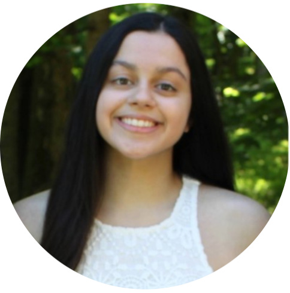
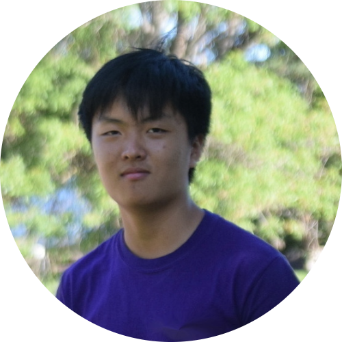

<!-- Main -->

<!-- One -->
<section id="one">
	

		<header class="major">
			<h1><i>We are:</i> Environmental</h1>
		</header>

<!-- Content One -->

The Environmental Research Group is an undergraduate science and policy think tank devoted to interfacing science and social good to create sustainable change in Chicago through applicable, data-driven modeling. Science can oftentimes be void of application to the real world. So, the ERG was created to help build the bridge between data-driven solutions and real-world impact.

<!-- Two -->
<section id="one">
	

		<header class="major">
			<h1><i>We are:</i> Founded in Research</h1>
		</header>

<!-- Content Two-->

The Environmental Research Group has three main Working Groups. 

	

		<h3>Data Analysis</h3>
		
The Data Analysis Group finds interesting trends with water quality data, creates relevant graphics and maps, holds Environmental Data Science workshops, and uses python/basic programming to work with real data from the City of Chicago to develop dynamic models and use machine learning to fore-cast changes

	

<!--	

		<h3>Modeling</h3>
		
The Modeling working group works with and develops geospatial and temporal environmental models, with particular interest in Machine Learning.

	
 -->
	

		<h3>Policy</h3>
		
The Policy Group creates timelines for Chicago’s actions over history, writes and publishs policy recommendation reports, contacts and meets with law and policy professionals to discuss results and potential next steps, and recommends directions for further research.

	

	

		<h3>Community Outreach</h3>
		
The Community Outreach Group helped create a UChicago-wide RSO sustainability committee, conducts human research through surveys and interviews,
organizes community service opportunities and fireside chats, interviews city officials who make policy decisions, and gets hands-on experience in the local community.

	

<!-- Three -->
<section id="one">
	

		<header class="major">
			<h1><i>We were (new board info coming soon!):</i></h1>
		</header>

<!-- Content Three-->

	

		

			
			<h4 style="text-align:center">Diya Gandhi | Co-President</h4>
		

		

			
			<h4 style="text-align:center">Matthew Rubenstein | Co-President</h4>
		

		

			
			<h4 style="text-align:center">Yoohan Ko | Director of Media and Outreach</h4>
		

		

			
			<h4 style="text-align:center">Xander Deanhardt | Community Outreach Liason</h4>
		

		

			
			<h4 style="text-align:center">Ethan Jiang | Policy Liason</h4>
		

		

			
			<h4 style="text-align:center">Jen Spinoglio | Director of Data Analysis New Member Training</h4>
		

		

			
			<h4 style="text-align:center">Noah Crutchfield | Policy Group Co-Leader</h4>
		

		

			
			<h4 style="text-align:center">Zachary Kratzer | Community Outreach Group Co-Leader</h4>
		

		

			
			<h4 style="text-align:center">Katja Edwards | Community Outreach Group Co-Leader</h4>
		

		

			
			<h4 style="text-align:center">Sammy Thiagarajan | Data Analysis Group Co-Leader</h4>
		

		

			
			<h4 style="text-align:center">Kevin Lin | Data Analysis Group Co-Leader</h4>
		

		

			
			<h4 style="text-align:center">Shayona Basu | Treasurer</h4>
		

		

			
			<h4 style="text-align:center">Mehak Rattan | Communications</h4>
		

	

<!-- End -->

