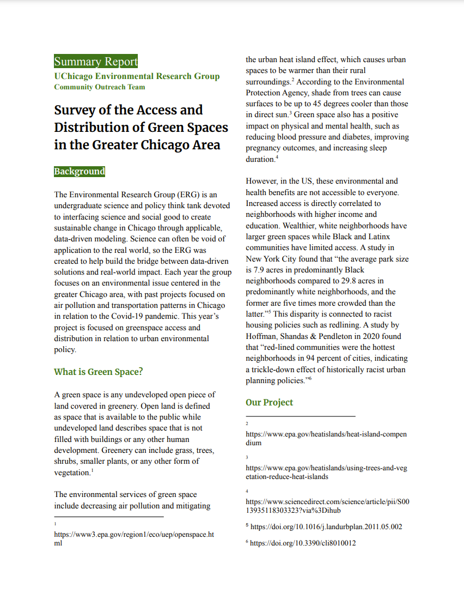

# About
The Environmental Research Group conducted a multi-faceted research project on green space distribution in Chicago during the 2021-2022 academic year. Given the well-known benefits of green space, such as air pollution reduction and positive physical and mental health impacts, Chicago’s poor green space quality and inequity is a major cause for concern. We conducted our research along three channels. Our Outreach Team connected with local environmental organizations and city representatives to learn about Chicago green space and environmental justice issues directly from those who experience them and are working to find solutions. The team conducted interviews with three organizations that work with green space distribution and accessibility in Chicago and culminated the findings in a final report. The organizations interviewed include CMAP, an urban planning organization that studies land use and works to improve public access to green spaces, Openlands, a conservation organization that protects and creates green space in northern Illinois, and Bay Area Wilderness Training, an organization headed by a former UChicago student that helps impoverished youth access nature. Our Policy Team looked into policy proposals to overcome the green space inequity of Chicago. They investigated the impact and feasibility of green roof incentives, based on the success of Toronto’s 2009 bylaw. Finally, our Data Analysis Team worked to establish and visualize a variety of correlations to investigate causes of Chicago’s green space inequity, and green space benefits. This included quantifying the effects of property sales, land surface temperatures, and the impact of park access in Chicago.

# Deliverables
* Proposal for improving green space access in Chicago in the next 5 years. 
* Summary document of interviews with community organizations dedicated to expanding green space.
  *
<a href="asset/images/Green Space Summary Report.pdf">Survey of the Access and Distribution of Green Spaces in the Greater Chicago Area</a>

* Visualizations and maps of current and historical green space and the tree canopy of Chicago.

