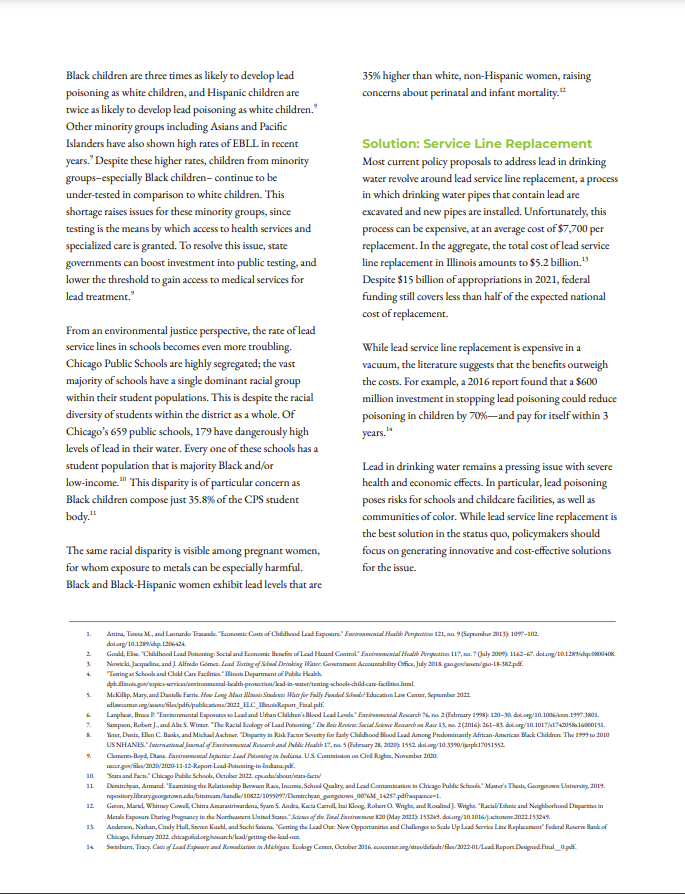

# About
Lead contamination in drinking water remains a pressing concern, especially in the state of Illinois and the city of Chicago, which has around 400,000 lead service lines (the most of any U.S. city). We conducted a review of relevant local, state, and federal legislation on water quality. Our analysis focuses on the impact of lead contamination on schoolchildren and touches on the effects of redlining on this issue. Methods included both (a) examination of the current policy landscape and (b) cost-benefit analysis regarding the impact of lead in Chicago water lines. Analysis of past legislation’s successes and failures aims to motivate new methods or replicate old ones, mainly focusing on the Clean Water Act (1972), Safe Drinking Water Act (1974), Public Act 099-0922 (2017) and the Lead and Copper Rule (1991/2021). In our cost-benefit analysis, we gather data relating to economic, social, and health costs which all point to lead line replacement as the solution. We recommend different preventative and mitigative measures and quantify associated costs. The service line replacement program implemented in Newark, New Jersey saw significant successes that should be replicated in Chicago. These successes were the result of both specific technical tools such as trenchless replacement techniques and improved corrosion control systems, and also the result of socio-legal tools including policies to allow replacement with homeowner consent. There is also an opportunity to significantly improve health by expanding the use of activated carbon filters in public buildings including schools. Lead-contaminated drinking water continues to negatively affect residents across Chicago. Solving this problem requires vast reform of current policy and public infrastructure across the city’s various communities.

# Deliverables
**Data Analysis**
The project we’re be looking into this year will be on Chicago water quality, with the main focus being lead contamination. We have divided into smaller subgroups, with each one focusing on an individual topic to investigate and analyze, similar to last year. Our role, as leaders, will be to teach new members with no data science experience how to code, and to integrate those members into the smaller working groups as we guide the groups towards deliverables.  Potential data sources will include the City of Chicago data portal and independent research.
* 
<a href="assets/images/ERG Lead Abstract.pdf">Lead Testing Disparity in Income</a>

**Community Outreach**
The ERG’s Community Outreach team is creating and distributing a survey to residents of different Chicago neighborhoods to gain insight into what community members know about lead in Chicago drinking water and hear how this issue affects their lives. We also hope to go out into the community to talk to those affected by lead pollution, hear their concerns, and help them test their water for lead. We would also like to interview various organizations involved in this issue. Ultimately, we will produce a report based on the results of the survey and our interviews with community organizations.

**Policy**
The policy group is focusing on Chicago-specific water quality policies, with a specialized focus on lead poisoning,  regulated by both the city and the Illinois Pollution Control Board. We aim to analyze both its objectives and results in correlation to the U.S. Clean Water Act, and offer insight and suggestions on how policies in Chicago can better complement the principles of the CWA, and provide a healthy water source for its residents and surrounding environment.
* 
<a href="assets/images/US Water Policy Reference Sheet.pdf">US Water Policy Reference Sheet</a>

* 
<a href="assets/images/Chicago Lead and Water Fact Sheet.pdf">Chicago Lead and Water Fact Sheet</a>

* 
<a href="assets/images/Chicago Lead Crisis _ ERG Policy.pdf">Chicago Lead Crisis Overview</a>

  

    
  

  

   
  

